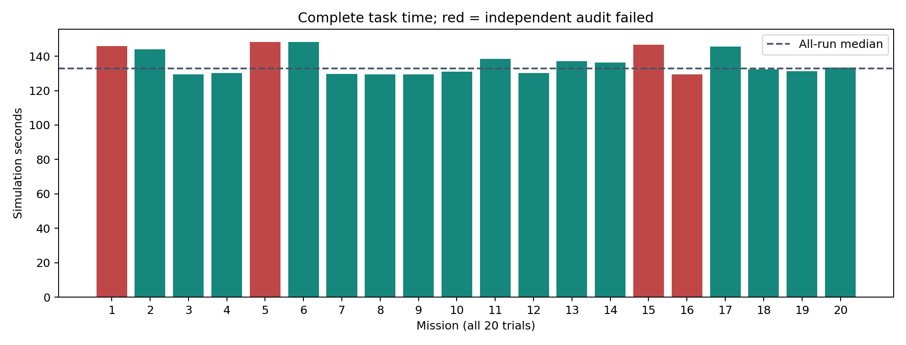
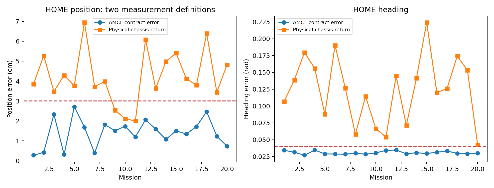
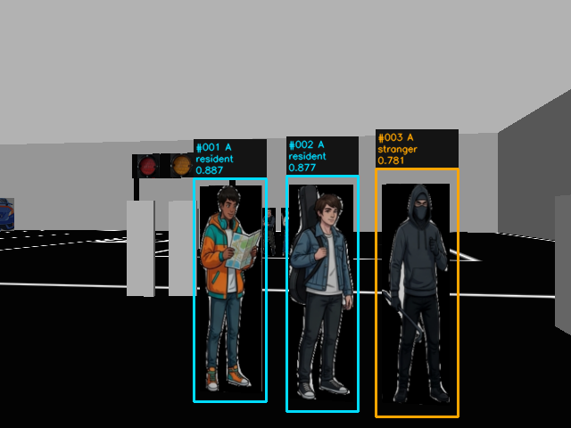
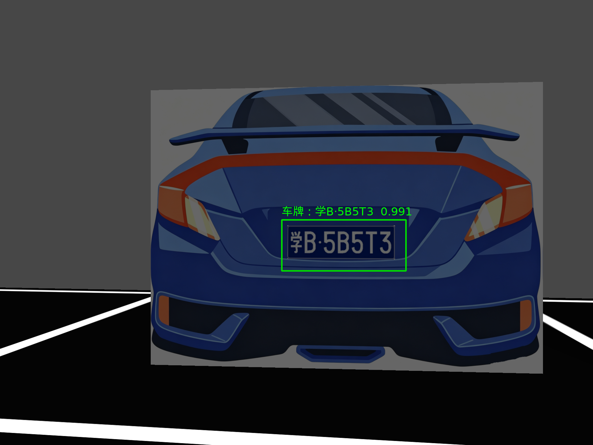
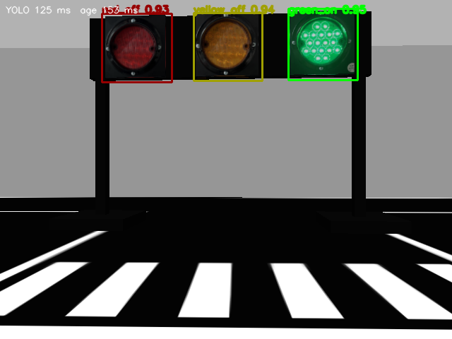

# 智算三行队：20次完整任务数据（2026-09-29）

本报告保留全部任务结果和启动中断记录，展示样例不替代总体统计。运行源码来自 `main` 提交 `5efd120`，运行冻结代码 `d9a61b4`；导航43个冻结文件一致。统计工具只读取已关闭的bag。

## 样本口径

共20次实际发车的十点任务：前9次为 `docs20_01…09`，后11次为 `docs20b_11…21`。每次重启仿真、随机抽取3块车牌，原速度/白线/绿灯/识别阈值保留。第10次窗口BadWindow、随后11/12启动中断另列，未冒充任务样本。补跑21凑齐20次。运行过程还有准备阶段 `docs_data_1` 同名ROS节点被替换的中断，原目录保留，不在本批20次中。

前9次开启比赛展示，后11次关闭judge窗口：原图/标注、检测、人物/车牌源帧、终端日志与bag继续保存；后11次没有judge_event配对记录，不能宣称这11次通过了比赛展示图文审计。GUI开销存在差异，耗时不能解释为完全相同的显示条件。

时长为motion bag中的仿真秒，包含任务内OCR等待；不包含场景/模型启动和完成后的约26秒语音。信号等待和各控制阶段时长为事件积分估计，不可相加。成功率用全部20次作分母，未剔除OCR失败。

## 全部样本统计

| 指标 | 结果 |
|---|---|
| 原独立完整验收 | 16/20（80.0%） |
| 导航/白线/绿灯/速度/AMCL回位分项 | 19/20 |
| 报告人数18/16/2、A/B各9与场景库存一致 | 20/20 |
| 人物完整独立验收（含播报） | 17/20 |
| 已完成独立审计中人数核对 / 类别全部正确 | 18 / 18 轮 |
| 车牌整牌字符正确 | 58/60 |
| OCR多帧一致且达到原阈值 | 58/60 |
| 不同场景车牌号码 | 15 个 |
| 全部20次任务均值 / 中位数 | 136.309 / 132.825 秒 |
| 全部20次最短 / 最长 / 样本标准差 | 129.343 / 148.374 / 7.353 秒 |
| 通过轮次均值（n=16） | 134.744 秒 |
| 第7点对齐后回到路径模式总次数 | 1 |
| 第7点最终对齐map估计航向误差变号（>0.01rad）总次数 | 0 |
| 比赛展示图文对应审计 | 9/9；其余未采集 |
| 同周期命令配对 | 54235/54240 条，移动命令漏配1条 |

人物置信度取模型原始输出，全体最低为 0.39173。人数/类别正确不等于模型概率已校准或训练问题已经解决。OCR失败轮次未进入完成播报流程，原人物审计因缺音频证据不能完成；报告人数一致与完整人物验收通过分开统计，缺失证据不标成通过。

开启judge显示的9轮均值137.141秒；关闭judge显示的11轮均值135.628秒。这只是分组统计，OCR等待、定位和信号时序也会影响耗时，不能把差值全部归因于窗口。

## HOME：定位验收与实际车身回位

原完整审计使用AMCL/map合同位姿。补充检查以同一bag第一帧和最后一帧Gazebo车身真值相减，直接检查相对出发位置和方向；不使用未标定的map/world绝对坐标差。车身与轮轴结果均保留。

实际车身满足3厘米和0.04弧度的轮次：0/20。车身位置差均值4.233厘米，范围2.000–6.944厘米；方向差均值0.12381弧度。
因此不能把原独立审计通过写成实际车身精确回到原位、原方向。该差异单独报告，当前用户已要求冻结导航，本次未调参或修改控制器。是否满足物理回位要求，应看这一列，不能只看AMCL列。

## 每次任务明细

| 序号 | RUN_ID | 原完整审计 | 时长s | 第7点s/回转次数 | 人数 | OCR整牌 | AMCL回位cm | 实际车身回位cm/rad |
|---:|---|---|---:|---|---:|---:|---:|---|
| 1 | [20260929_docs20_01](evidence/20260929_docs20_01/independent_audit.json) | 失败 | 145.834 | 7.83/0 | 18 | 2/3 | 0.276 | 3.854/0.10669 |
| 2 | [20260929_docs20_02](evidence/20260929_docs20_02/independent_audit.json) | 通过 | 143.919 | 5.74/0 | 18 | 3/3 | 0.424 | 5.278/0.13866 |
| 3 | [20260929_docs20_03](evidence/20260929_docs20_03/independent_audit.json) | 通过 | 129.343 | 4.93/0 | 18 | 3/3 | 2.333 | 3.478/0.17948 |
| 4 | [20260929_docs20_04](evidence/20260929_docs20_04/independent_audit.json) | 通过 | 130.156 | 5.33/0 | 18 | 3/3 | 0.315 | 4.294/0.15604 |
| 5 | [20260929_docs20_05](evidence/20260929_docs20_05/independent_audit.json) | 失败 | 148.261 | 5.87/0 | 18 | 2/3 | 2.712 | 3.768/0.08787 |
| 6 | [20260929_docs20_06](evidence/20260929_docs20_06/independent_audit.json) | 通过 | 148.374 | 11.06/1 | 18 | 3/3 | 1.677 | 6.944/0.19036 |
| 7 | [20260929_docs20_07](evidence/20260929_docs20_07/independent_audit.json) | 通过 | 129.571 | 6.04/0 | 18 | 3/3 | 0.389 | 3.720/0.12681 |
| 8 | [20260929_docs20_08](evidence/20260929_docs20_08/independent_audit.json) | 通过 | 129.413 | 5.93/0 | 18 | 3/3 | 1.822 | 3.988/0.05814 |
| 9 | [20260929_docs20_09](evidence/20260929_docs20_09/independent_audit.json) | 通过 | 129.398 | 5.98/0 | 18 | 3/3 | 1.506 | 2.541/0.11445 |
| 10 | [20260929_docs20b_11](evidence/20260929_docs20b_11/independent_audit.json) | 通过 | 130.952 | 5.48/0 | 18 | 3/3 | 1.732 | 2.106/0.06631 |
| 11 | [20260929_docs20b_12](evidence/20260929_docs20b_12/independent_audit.json) | 通过 | 138.534 | 5.64/0 | 18 | 3/3 | 1.190 | 2.000/0.05397 |
| 12 | [20260929_docs20b_13](evidence/20260929_docs20b_13/independent_audit.json) | 通过 | 130.142 | 6.05/0 | 18 | 3/3 | 2.063 | 6.090/0.14478 |
| 13 | [20260929_docs20b_14](evidence/20260929_docs20b_14/independent_audit.json) | 通过 | 137.195 | 6.34/0 | 18 | 3/3 | 1.588 | 3.635/0.07118 |
| 14 | [20260929_docs20b_15](evidence/20260929_docs20b_15/independent_audit.json) | 通过 | 136.411 | 6.31/0 | 18 | 3/3 | 1.075 | 4.982/0.14150 |
| 15 | [20260929_docs20b_16](evidence/20260929_docs20b_16/independent_audit.json) | 失败 | 146.665 | 7.07/0 | 18 | 3/3 | 1.502 | 5.408/0.22411 |
| 16 | [20260929_docs20b_17](evidence/20260929_docs20b_17/independent_audit.json) | 失败 | 129.513 | 6.41/0 | 18 | 3/3 | 1.345 | 4.122/0.11991 |
| 17 | [20260929_docs20b_18](evidence/20260929_docs20b_18/independent_audit.json) | 通过 | 145.616 | 6.46/0 | 18 | 3/3 | 1.718 | 3.797/0.12601 |
| 18 | [20260929_docs20b_19](evidence/20260929_docs20b_19/independent_audit.json) | 通过 | 132.362 | 6.01/0 | 18 | 3/3 | 2.467 | 6.398/0.17421 |
| 19 | [20260929_docs20b_20](evidence/20260929_docs20b_20/independent_audit.json) | 通过 | 131.231 | 5.84/0 | 18 | 3/3 | 1.235 | 3.444/0.15335 |
| 20 | [20260929_docs20b_21](evidence/20260929_docs20b_21/independent_audit.json) | 通过 | 133.289 | 6.32/0 | 18 | 3/3 | 0.733 | 4.811/0.04245 |

第7点回转列仅指FINAL_HEADING之后重新进入行驶/补位模式。它不能排除此前路径对齐先越过拍照朝向、随后摆正的动作。新增map航向误差变号检查只覆盖最终对齐/稳定阶段，不能用来宣称第7点全程没有用户观察到的大转向。

## 失败与展示样例

`20260929_docs20_06` 的第7点出现1次对齐后回转补位，耗时11.06秒。该轮仍达到原到点验收，但不满足动作完全无冗余的描述；作为反例保留。
- `20260929_docs20_01`：原审计失败项 `parking_pass;person_report_pass;plate_ocr_pass`。参阅原审计和对应源图，未回写结果。
  `POINT_9` 真值 `晋QQ11T7`；逐帧原始读数/置信度：`晋Q·Q1IT7` 0.84548（LOW_OCR_CONFIDENCE）; `晋Q·Q1IT7` 0.84196（LOW_OCR_CONFIDENCE）; `晋Q·Q1IT7` 0.84276（LOW_OCR_CONFIDENCE）。保留0.85和至少2帧一致的原规则，未用真值补写识别结果。
- `20260929_docs20_05`：原审计失败项 `parking_pass;person_report_pass;plate_ocr_pass`。参阅原审计和对应源图，未回写结果。
  `POINT_9` 真值 `晋QQ11T7`；逐帧原始读数/置信度：`晋Q·Q1IT7` 0.84988（LOW_OCR_CONFIDENCE）; `晋Q·Q1IT7` 0.85115（有效帧）。保留0.85和至少2帧一致的原规则，未用真值补写识别结果。
- `20260929_docs20b_16`：原审计失败项 `speed_pass`。参阅原审计和对应源图，未回写结果。
  移动命令漏配1条；原同周期配对上限0.025秒，未放宽。
- `20260929_docs20b_17`：原审计失败项 `person_report_pass`。参阅原审计和对应源图，未回写结果。
  人物最大位置误差8.376厘米，原要求8厘米；人数和类别正确仍不能替代位置验收。
- `fastest_accepted`：`20260929_docs20_03`，只作为明确标注的展示样例。
- `representative_with_display`：`20260929_docs20_04`，只作为明确标注的展示样例。
- `strong_visual_scores`：`20260929_docs20b_19`，只作为明确标注的展示样例。
- `point7_reentry_counterexample`：`20260929_docs20_06`，只作为明确标注的展示样例。

## 可用于PPT的原始展示图片

人员示例来自 `20260929_docs20b_19`，框与置信度为原始检测结果：

车牌示例来自同一轮的POINT_10：

红绿灯示例来自 `20260929_docs20_04`，对应原图和终端审计均保留：

PPT可展示示例照片、终端与OCR裁剪，并同时报告20次总体通过率、时长范围及物理回位差异。不使用最佳样例的耗时或置信度冒充均值，不写20/20完美任务。

## 数据与复现

- [全部20轮CSV](all_twenty_runs.csv)，[全部点位时长CSV](all_point_timings.csv)，[结构化统计与选样规则](results.json)。
- `evidence/` 保存全部20轮审计、汇总、关键日志；示例和失败轮次另存照片/OCR图及元数据。
- 完整motion bag、深度数组、全量高清帧在本机 `/home/sz/ros1_ws/photo_stops/standee_route_runs/<RUN_ID>`，未上传GitHub。
- 92个2026-09-27/28旧bag已按用户要求删除，释放约406.22GiB；原照片/结果仍在。删除清单见 `legacy_bag_cleanup_20260929.json`，原bag不能从GitHub结果文件恢复。本批20个bag和之前最终验证三轮bag仍保留。
- 离线复现：在ROS环境先运行原审计（带 `--require-command-decisions`）、阶段统计和 `analyze_docs20_run.py <RUN_DIR>`；再运行 `build_docs20_report.py --output <OUTPUT_DIR>`。
