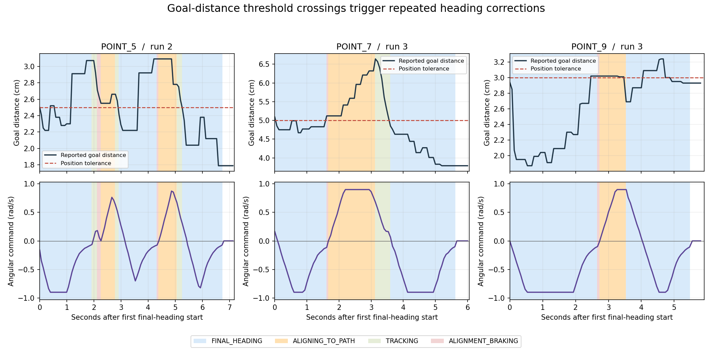

# 到点停顿与反复转向：回放诊断

## 已确认的机制

第2轮POINT_5、第3轮POINT_7和POINT_9均出现：进入最终拍照朝向调整 → 位置误差越过验收阈值 → 恢复行驶朝向/补位 → 再次调整拍照朝向。

这些阶段的进度记录中，门禁均为 `CLEAR`。控制器仍在发转向/补位指令，不能解释成红灯等待或整个任务执行器停止。

| 运行/点位 | 位置阈值 | 第一次最终转向结束后的误差 | 最终朝向调整段数 | 首段结束至末段结束的时间 |
|---|---:|---:|---:|---:|
| 第2轮 POINT_5 | 2.50 cm | 3.07 cm | 3 | 4.799 s |
| 第3轮 POINT_7 | 5.00 cm | 5.12 cm | 2 | 3.988 s |
| 第3轮 POINT_9 | 3.00 cm | 3.02 cm | 2 | 2.799 s |

最后一列是实际反复调整阶段的时长，包含补位和再次转向，不是保证可以全部省掉的时间。POINT_9约超0.2毫米就进入了新的补位回合，但不能直接放宽3厘米验收要求。

图中红虚线为位置阈值，蓝色背景为最终朝向调整、橙色为行驶朝向调整；下方转向指令多次变号，证实车实际收到相反方向的转向命令。图来自完整关闭的bag，非虚构轨迹。

## 对应源码

`ros_packages/forward_path_follower/src/forward_path_follower.cpp` 中，到点判定和朝向模式切换存在以下关系：

1. `goal_distance <= target_xy_tolerance_` 时立即进入最终朝向调整，没有为随后转向期间的位置变化预留距离。
2. 转向期间，在距离未超过“容差+2厘米”且朝向未到位时，仍保留最终朝向模式。
3. 当朝向到位但距离稍超原容差时，`abs(yaw_error) <= target_yaw_tolerance_` 分支立即退出最终朝向模式。
4. 下一段按照目标连接线重新选择行驶朝向。距离再次进入容差后，又进入最终朝向调整，形成反复切换。

三个案例切换时的估算航向误差分别约0.0213、0.0338、0.0322弧度，已在各自航向容差内；位置却在容差外。因此模式切换与源码条件一致。距离来自执行器进度话题，TF位姿使用当时最新收到的变换组合，未重建TF时间插值，不把亚毫秒/亚毫米差值当精确传感器测量。

## 不能全部归因于AMCL噪声

另外检查Gazebo实际车体位姿。使用模型和里程计代码中的前轮轴距车体中心0.0525米偏移，换算前轮轴点，避免把转向时车体中心绕轴的位移误认为平移。

剔除每段开始的0.2秒后，最终朝向阶段中前进指令为0，而轴点仍有约2.0–6.7毫米的实际位移。位置估计变化还叠加了定位更新。当前证据可以确认模式切换的触发机制，但尚未分解真实位移、轮编码器误差和定位修正的各自贡献，也没有证明具体是打滑或接触参数导致。

## 修复方向与边界

下一项建议单独验证：最终转向前，先把位置收敛到原容差内部，给转向期间的位置变化预留余量；最终任务验收仍使用原位置和航向阈值。具体余量需要用历史位移和实际新测试确定，不能直接承诺消除所有重复转向。

暂不提高速度上限，不放宽白线/绿灯限制，也不直接把“朝向已经到位、位置仍超差”判成成功。本轮仅新增只读诊断工具和记录，未修改导航控制器或运行配置，原运行源码冻结和3/3验收仍是此前版本的记录。

## 数据与复现

- 工具：`scripts/diagnose_navigation_run.py`，源码提交 `e714a22`；运行前备份 `backup/task009-before-diagnosis-20260929`，归档前备份 `backup/task009-before-diagnosis-record-20260929`。
- 数据：`diagnosis_20260929/20260929_task009_heading_2.json`、`20260929_task009_heading_3.json` 和 `summary.json`。
- ROS容器示例：`python3 /root/diagnose_navigation_run.py /root/ros1_ws/photo_stops/standee_route_runs/20260929_task009_heading_3 --goals POINT_7,POINT_9 --output /tmp/diagnosis.json`。
- 目标按目标坐标和执行器点位名称匹配。第2轮bag缺少首个 `/move_base/goal` 消息，不能按录到的第几个goal推断点号；该缺失不等于小车没有执行POINT_1，原任务照片、进度和成功结果均有记录。
- 仿真真值只用于离线诊断，没有提供给线上导航或识别决策。
