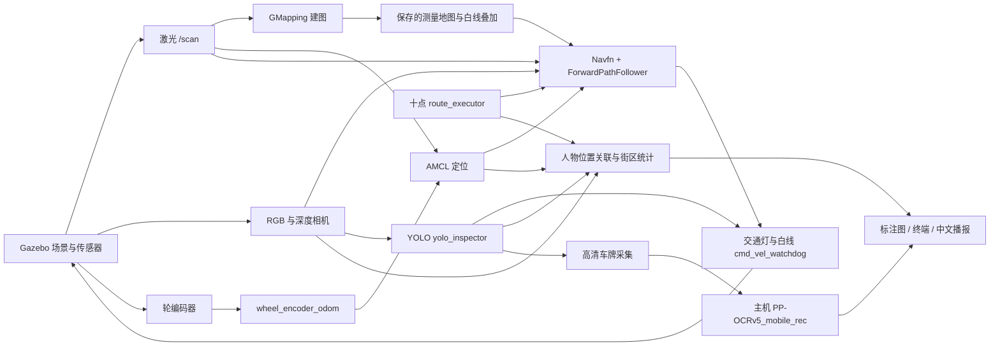

# 智算三行队—智慧社区复赛技术方案（整理草稿）

队伍：智算三行队。日期：2026-09-30。队员、指导教师、最终实车硬件型号：待填写。本文件依据当前工程和20轮完整任务数据整理；正式提交需配图排版并导出同名 PDF。

## 1. 任务与实现状态

仿真场景包含红绿灯、人物立牌、车牌、实体障碍和车道白线。当前系统支持 GMapping 建图、AMCL 定位、激光与深度联合避障、十点拍照巡检、绿灯判定、人物分类统计、高清车牌 OCR 和回 HOME 停车。十点任务以固定场景验证，物理车身精确回位尚未达标。

## 2. 软件架构与通信

ROS topic 传输相机、深度、激光、里程计、检测 JSON 和门控状态；`move_base` action 负责目标执行与结果反馈；TF 提供 map、odom、base_footprint、camera_optical_frame 的空间关系。相机源帧时间戳同时关联原图、检测、深度和 TF，避免混用旧识别结果。

## 3. 建图与定位

GMapping 地图分辨率为 0.05 m，使用激光扫描与里程计，保存 YAML/PGM、轨迹与来源 manifest。建图演示必须从同一会话连续行驶，不能以车辆瞬移拼接地图。现有建图入口使用 Gazebo 位姿里程计，这是仿真专用依赖；导航阶段使用轮编码器里程计与 AMCL，实车建图需替换为真实编码器与 IMU。

AMCL 在已测量地图上定位；白线导航图由测量地图和场地纹理叠加产生，保留测量图 SHA。真值诊断图、测量图和导航规则叠加图分别标记。完整建图过程的屏幕录像仍需录制，保存地图文件本身不能替代该录像。

## 4. 路径规划、避障和任务执行

全局规划采用 Navfn；局部控制采用本项目 `forward_path_follower/ForwardPathFollower`，检查机器人 footprint、前方轨迹及原地转向扫掠。最高前进指令 0.35 m/s、最高角速度 0.90 rad/s。局部代价地图同时接收 LaserScan 和深度 PointCloud2；高度过滤避免把红绿灯横梁识别为地面路障。

任务执行器只发送 POINT_1…POINT_10 和 HOME，按合同路线监测进度；照片需满足位置、航向、目标数量和画面边缘检查。普通位置容差 3 cm、航向容差 0.04 rad，个别点位有配置例外，不能统一声称所有点位达到 3 cm。HOME 要求位置误差不超过 3 cm、航向误差不超过 0.04 rad，并保持至少 2 秒静止。

门控结合视觉红绿灯结果、连续新鲜帧和剩余绿灯时间。普通白线不可压过；停止线及斑马线等条件标记只在合法授权下经过。无进度与末端对齐超时会停止任务并保存失败数据；不会把失败轮次计为通过。

## 5. 视觉检测与 OCR 机制

实际检测权重为 `best.pt`，SHA-256：`fe502091a4e964371eee3b08ec26029ad653019250d5406e13dc68ce8969a2ad`。九类为 resident、stranger、六种红黄绿灯亮/灭状态及 license_plate。检测结果用于灯态判断、人物类别和车牌框；YOLO 处理上限设置 5.5 Hz，运行审计检查有效频率、延迟和帧龄。

用户提供的新视觉包中，数据集报告声称训练图 285 张、验证图 18 张，人物两类在验证集中各只有 1 个标注。该报告来自包内资料，本次未对原训练数据重新核验，不能将报告中的 mAP 当作本系统实测指标。后续训练需增加仿真多视角/距离/光照样本与实车数据，按场景拆分训练和验证，平衡少数类并避免同帧泄漏。

当前 OCR 链路为车牌框 → 独立1920×1440相机原图 → 保留源帧的车牌裁剪 → 主机独立 PP-OCRv5_mobile_rec → 文字规范化、多帧一致性和0.85置信度门槛。运行入口默认开启；本地模型权重与依赖锁定文件已纳入工程包。20轮共60块车牌，整牌正确58块；两次失败都发生在 `晋QQ11T7` 的 `1/I` 混淆，并因原阈值没有足够有效帧被拒绝。失败图和原始分数保留，未使用场景真值补写输出。

## 6. 人物定位、统计和输出

从人物框中央躯干区域取前景深度，结合相机内参和同源帧 map→camera TF 估计位置；按空间多边形归属 A/B。使用位置、外观和一对一关联去重，同一源帧重放不增加人数。分类冲突、深度缺失和街区不明确会标为待复核。期望人数只用于验收，报告人数由图像观测累计得到。

每个人物点位保存人员编号、类别、置信度、位置和标注图；外来人员另存裁剪。终端与标注 topic 使用一致源帧，结束后输出街区统计与中文 WAV。当前验证对象是静态人物展板，对移动人员、遮挡、换装及真实社区身份认证尚未验证。

## 7. 仿真车辆与实车硬件方案

仿真小车采用差速驱动，配有激光、RGB/深度相机和编码器接口。运行 footprint 在轮轴坐标系配置，并包含车身与安全余量；实体尺寸需以 world 和配置为准。

面向实车的建议结构为：差速底盘与编码器电机、下位机闭环电机控制、主计算单元、1个360度激光雷达、1个RGB-D立体相机、最多1个用于高清车牌的单目相机、IMU、稳压电源和急停。主计算单元运行 ROS 与视觉；下位机负责速度反馈、看门狗和紧急停车。具体型号、算力、续航与预算需由队伍最终确定，现阶段属于设计方案而非已装配硬件。

## 8. Sim2Real 部署

替换 Gazebo 驱动层，保持 scan、相机、深度、odom 与速度命令接口；实际里程计不得来自 Gazebo 真值。标定轮径/轮距、相机内参、雷达与相机外参，核验 TF 及时间同步；重新测量实车 footprint、制动距离和速度上限。

对实地数据采集不同曝光、阴影、反光和远近视角；扩充训练集。对深度缺失与反光保留无效状态，以激光和保守停车补充，不能把背景深度当作人物距离。红灯、未知灯态、传感器断流、识别过期、离开路线及碰撞风险需要明确停车与恢复策略。先低速单功能验证，再多点和长时任务。

## 9. 已有证据与待完成项

冻结源码的20轮实际任务原独立审计16/20通过，平均136.309仿真秒，最短129.343秒，最长148.374秒；白线接触和未授权通行均按原审计保存。人物报告20次均为18人（社区16、外来2，A/B各9），其中17次完成人物全部独立验收；两次OCR失败轮次因缺最终播报不能计入完整人物验收，另有一次人物位置误差8.376厘米超过8厘米限值。车牌整牌58/60正确，覆盖15个不同号码；第7点有1/20再次补位。3次早期连续完整通过作为历史阶段，不能替代这20轮统计。

原 HOME 验收用 AMCL/map 位姿。以Gazebo车身真值同一轮的起终点相减，20轮实际车身相对偏差平均4.233厘米、0.12381弧度，严格3厘米与0.04弧度下0/20双项同时达到。实车部署必须核对编码器、AMCL、TF与物理位置基准；不能仅凭AMCL报表宣称物理精准回位。一个完整任务另有一条移动命令记录跨过原0.025秒审计配对门槛，仍按失败保存，不放宽门槛。详细逐轮数据和失败原因见随附 `05_运行证据/REPORT.md`。音频播放进程成功不等于人耳听感验收。

工程源码ZIP已在现有ROS Noetic环境从解压副本构建四个catkin包并完成一轮十点任务，独立审计通过；使用了现有Python3.12 OCR依赖。新电脑首次安装依赖的过程仍待复测。还需录制全景/完整建图与巡检的Gazebo+RViz同屏视频、核心代码讲解和全队答辩视频，确定具体实车硬件型号，制作正式技术方案与幻灯片PDF。正式素材应使用20轮总体统计并标注展示样例，不能只挑最顺的一轮代替通过率。数GB级bag留本地，不放进150MB工程ZIP。
